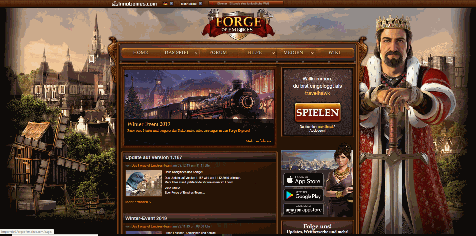

# Forge of Empires Bot
Simple bot for Forge of Empires implemented with [Sikulix](http://sikulix.com/). The bot collects money, tools, army and goods so that I don't have to do this by myself.

## Demo
The following demo shows what the bot is doing. You see a screen capture after the bot is executed.

## Usage

The script uses only visual features. For the login, the user must be kept logged in. The script doesn't uses any password. However you might need to change some screen captures like the *server name* for the login.

If you want to use the bot for yourself, do the following:
1. Download [Sikulix](https://launchpad.net/sikuli/+download)
2. Open FoE-Collect.sikuli
3. Change appropriate images to fit your account
4. Run Script and lean back =)

To collect new resources not only once, but continually, you can use a planned task (Windows) or cronjob (Linux).

Note: I made this bot 2018. It still works (December 2019), but the website might change. However this code gives an idea how to customize your own bot.
